# Pi Forensics Suite

**Low-budget digital forensic imaging for Raspberry Pi and ARM single-board computers**

[](#-prerequisites-setup--usage)
[](LICENSE)
[](#)
[](CHANGELOG.md)
[](https://github.com/n0sfs/pi-forensics/releases)

> ### A field imaging station, not a full workstation replacement.

A commercial write-blocker and imaging workstation can run into the thousands of dollars — out of
reach for a student, a hobbyist, or a small shop that only needs to image a drive occasionally. A
$50-100 Raspberry Pi (or comparable ARM board) with a USB write-blocker adapter, running this
software, gets you bit-for-bit acquisition with on-the-fly hashing, a hardware-independent
write-blocker toggle, chain-of-custody logging, and DFIR-structured reporting — all from a
touchscreen kiosk or a browser on your laptop. It doesn't replace a full forensic workstation for
deep analysis, but for the "image it, verify it, document it" step that starts almost every
examination, it doesn't need to.

This project is the open-source software layer described in the original research
**["Low Budget Forensics using ARM Based Single Board Computers"](https://commons.erau.edu/jdfsl/vol11/iss1/3/)**
— substantially extended since, with case management, mobile device acquisition, file recovery
tooling, and a full reporting workflow added on top of the original imaging core.

📖 **New here?** [Quick-Start Guide](docs/quickstart.md) gets you from a fresh Pi to a completed,
hashed acquisition and a PDF report in about 20 minutes. For the full feature reference once you're
running, see the [User Manual](docs/user-manual.md).

---

## Why use this?

- **Cost.** ARM SBC + storage + a write-blocker adapter, versus a dedicated forensic imaging
  appliance. The gap is not small.
- **Field-ready.** Runs headless or as a touchscreen kiosk, boots straight into the acquisition
  screen, and is small/light enough to carry in a field kit.
- **Guided, not bare-metal.** Every tool has inline help, live status, and a plain-language FAQ
  built for students and examiners who don't already have a CLI forensics workflow memorized.
  Nothing here requires memorizing `dd` flags.
- **Not a toy.** Under the hood it's the same tools examiners already trust — `dc3dd`, `dcfldd`,
  `ewfacquire`, `ddrescue`, PhotoRec, The Sleuth Kit, ExifTool, MVT — wired together with hashing,
  write-blocking, and audit logging, not a simplified reimplementation of them.
- **Yours.** Self-hosted, MIT licensed, no telemetry, no cloud dependency. Evidence never leaves the
  device you control.

---

<p align="center">
  
</p>

---

## What it does

### Acquisition
Bit-for-bit imaging with your choice of engine — `dc3dd` (default, on-the-fly hashing), `dcfldd`,
plain GNU `dd` (genuine `iflag=direct` cache bypass), `ewfacquire` for E01, and AFF via a
hashed-raw-then-convert pipeline — with MD5/SHA-1/SHA-256 verification built in. `ddrescue` lives
in the same screen as a format option, not a separate tool, with pass-strategy selection
(fast/trim/scrape/reverse) and a Mapfile Inspector for reviewing bad-sector results. A global
`udev` rule forces every connected USB storage device read-only at insertion; a Settings toggle
lets you deliberately unlock a destination drive when you need to. BitLocker, LUKS, and VeraCrypt
volumes can all be unlocked and acquired decrypted through one consolidated Encrypted Volume panel.
A **Preview This Drive (Read-Only)** button lets you browse a connected drive's filesystem before
committing to a full acquisition, and **Logical / Custom-Content Acquisition** packages specific
folders into a hash-verified evidence container instead of imaging a whole device. An optional
checkbox chains a successful acquisition straight into Auto Analyze against the image it produced.

### Live Collection USB
The station's one deliberate exception to write-blocking everything - a builder prepares a
separate, confirmed-blank USB drive (exFAT, gated behind typing the exact device path to confirm)
with a real open-source collector (UAC) for Linux/macOS/BSD and a hand-written PowerShell script
for Windows. Run it on a separate, still-running target machine to capture volatile state - running
processes with command lines, network connections and their owning process, logged-on sessions,
ARP/DNS caches, loaded kernel modules/drivers, and more - that a disk image alone can never
recover, since all of it is gone the instant that machine is powered off. On Unix-like targets UAC's
`ir_triage` profile also gathers live network state, mounted storage, package lists, shell/SSH
history, and a live-filesystem timeline; on Windows the bundled script also covers services,
scheduled tasks (with real last-run-time history), autoruns, installed hotfixes, mapped network
drives, clipboard contents, PowerShell console history, (when run elevated) Prefetch execution
evidence, a 30-day excerpt of the Security/System Event Logs (successful/failed logons,
workstation lock/unlock, account creation, process creation, service install/state-change, and
audit-log-clearing - the last two requiring elevation), and (also elevated) a live registry
pattern-of-life pull - the current user's, and every other real user's, RecentDocs/TypedPaths/
RunMRU/UserAssist/RDP connection history/Office and Explorer search MRU, plus the machine's own USB
device history, Bluetooth pairing history, Shimcache, BAM/DAM execution evidence, installed
programs, Amcache inventory, and ShellBags folder-browse history - saved live via the registry's own
backup API, the exact same way a proper offline hive export works, just without powering the machine
off first. Process executables
are hashed on both platforms for consistency. Both collectors can also acquire a
full memory (RAM) image of the target - AVML for Linux, WinPmem for Windows - through an
interactive, default-declined, space-and-privilege-checked prompt at collection time, since the
target's RAM size and available USB space are only known once the drive is actually plugged in.
Bring the drive back and import the results into the active case - read-only against the USB
throughout, every file individually hashed with a manifest, and a real case-report event recorded.
On import, the Windows-side results (processes, network connections, logged-on users, services,
scheduled tasks, autoruns, installed hotfixes, loaded drivers, ARP/DNS cache, system info, mapped
drives, clipboard, PowerShell history, Prefetch, the Event Log excerpt, and the live registry pull)
are automatically parsed into File Explorer's searchable "Parsed Artifacts" index
and the Evidence Timeline, every process executable's hash is cross-referenced against every
configured Hash Set with a match recorded as its own flagged artifact, and a
`SUMMARY.txt`/`summary.json` at-a-glance overview is generated alongside the raw files and full
manifest. Process launch time, network connection establishment time, hotfix install dates, and the
target's own boot time all carry their real, original timestamps on the Evidence Timeline - not just
when the collection itself ran.

### File recovery
One tool selector for PhotoRec (signature-based file carving, ~480 known types), `extundelete`
(journal-based recovery for ext2/3/4, preserves original filenames), `foremost`/`scalpel`
(alternate carvers, scalpel ships with a curated signature config), and read-only TestDisk
partition analysis — sharing one source/destination/case-metadata layout and one live terminal,
instead of a separate screen per tool.

### Mobile forensics
iOS full backup via `idevicebackup2` (with optional encrypted backup to capture Keychain data) and
Android via `adb pull`/`backup`/`bugreport` — a real `pull` also automatically captures the device's
full installed-app inventory (package name, version, install/update time, system vs. user-installed),
its configured accounts (Google, WhatsApp, or any other app-registered account, name shown in full),
and a snapshot of currently-visible notifications (which app, when, importance — real message
content is redacted by the OS itself, never captured), each via one non-invasive `adb shell dumpsys`
query, no root needed, parsed directly into the searchable index and Evidence Timeline alongside the
pull's own real on-device file timestamps — plus a **physical/raw acquisition mode for already-rooted
Android devices** — pipes the device's own raw block storage through `adb exec-out su -c dd` straight
into this app's own `dc3dd`/`dcfldd` engine (E01 isn't possible over a piped source), the same
hashing/write pipeline used for a locally-attached drive. Reads and displays real device detail before
you start — model, OS version, build, storage, IMEI, WiFi/Bluetooth MAC, activation state for iOS;
version, API level, manufacturer, build ID, and root/SELinux status for Android. This does **not**
bypass lockscreens, USB-debugging authorization, or root a device itself — devices must already be
unlocked/trusted (and, for physical acquisition, already rooted) by the examiner. On a rooted Android
device, Mobile Forensics can also pull the device's own WhatsApp key file directly, for use with File
Explorer's WhatsApp backup decryption below. A connected iOS device can also have its crash-report
logs pulled without touching the originals on the device. A third mode reads a SIM/UICC card inserted
in a connected PC/SC reader (ICCID, ATR, EID, application IDs).

### File Explorer & analysis
Browse local evidence and mounted network shares with inline preview (images, PDFs, and
sandboxed-rendered HTML render directly; other files show a metadata/info panel, plus a read-only
in-browser viewer for any `.db`/`.sqlite` file). Double-click an acquired image to browse **inside
its filesystem** via an in-process Sleuth Kit engine (`pytsk3`) — directory listing with real MACB
timestamps, recursive filename search, a full timeline view, and in-memory preview/extract, with
zero mount step. The right-click menu is context-aware — only tools that could actually apply to the
selected file, folder, or image are shown, and a tool already run against the exact selected file
shows a checkmark with the prior result. Right-click any file for ExifTool metadata, Binwalk, ClamAV, `strings`, `hashdeep`,
an MVT spyware/IOC scan, YARA rule scanning, and hash-set/known-bad-URL matching against your own
saved lists (with one-click MalwareBazaar/URLhaus imports). Dedicated artifact parsers recover
Windows Registry hives (incl. Amcache, ShellBags, Shimcache/AppCompatCache, UserAssist, BAM/DAM
program-execution timestamps, RDP connection history — which remote hosts this user connected to
via Remote Desktop, with the last-used username — Office recent files/folders per application,
Explorer search-box history, and Bluetooth pairing history), Event Logs, Prefetch,
Recycle Bin, LNK shortcuts, Jump Lists (Automatic/Custom Destinations), Thumbcache (extracting
every embedded thumbnail as a real, viewable image — these can persist after the original photo or
document has been deleted), Sticky Notes (the actual text of every note, including deleted
ones, correctly recovering recent edits that only exist in an unsaved database sidecar file), the
Windows Notification database (Action Center history, including the actual text pushed to
notifications) and Windows Timeline/Activity History (apps used, documents opened, websites
visited — richer on Windows 10 than on a post-Jan-2024-update Windows 11 image, disclosed rather
than treated as a parsing gap), SRUM (per-application network usage and execution history, tracked
over a rolling window even for since-uninstalled applications — one of the single highest-value
modern Windows artifacts), and PowerShell console command history (multi-line pasted commands are
correctly reassembled — no timestamp is ever recorded in this file, a real limitation of the format
itself, not a gap); the Windows Firewall connection log, when logging has been turned on (off by
default); NTFS `$MFT` (with
timestomping detection) and `$UsnJrnl` change-journal
records; Linux shell history (including zsh's timestamped `EXTENDED_HISTORY` format when a shell was
configured to record it), `/etc/passwd`, cron, and `auth.log`; macOS LaunchAgents/LaunchDaemons
persistence items (one of the most common real Mac malware-persistence techniques — works against an
already-extracted evidence folder regardless of the disk-image format; browsing *inside* a modern
Mac's own disk image isn't supported yet, since it uses a filesystem format this station can't open
directly — a real, disclosed limitation, not a silently-missing feature); cryptocurrency wallet files; email
files (`.eml`/`.mbox`/`.pst`/`.ost`); and mobile chat/app data (SMS/iMessage, Contacts, Call History)
straight out of an already-captured iOS backup — all without extracting anything first, real folder or
unmounted image alike. Fuzzy hashing (TLSH) catches a lightly-modified or recompiled variant of a
known file that an exact hash-set match would miss, and Volume Shadow Copies inside an NTFS image can
be listed and materialized as their own browsable images. Mobile-app-specific tools
round this out: recover deleted rows from any SQLite database (`SQLite Dissect`), static-analyze an
Android `.apk` (`androguard` — permissions, components, signing certificates, embedded URLs) or an
iOS `.ipa` (`Info.plist`, the embedded provisioning profile, optional Mach-O architecture/encryption
status via LIEF), decrypt a WhatsApp local backup against a pulled key file into a browsable SQLite
database and natively parse it - 1:1 and group messages (correctly resolving who sent what inside a
group chat), calls, and contacts, real message content and timestamps, no ALEAPP run required - and
deep-parse an already-captured `adb bugreport` archive into structured sections
(processes, packages, mounts, kernel modules, GPS, crash traces, sockets, battery/power events) - the
package install/delete log, GPS fixes, crash reports, and loaded kernel modules are also individually
indexed into the same searchable "Parsed Artifacts" list every other artifact type uses, not left
only in the full raw JSON output. For
a much deeper pass on an already-pulled Android or iOS extraction, right-click it and run
**ALEAPP/iLEAPP** — the same open-source, community-maintained parsers many examiners already use,
covering hundreds of app-specific artifacts (WhatsApp, Signal, Chrome, WiFi history, and far more),
each in its own isolated environment on the station so the two tools' conflicting dependencies never
collide — their output is automatically parsed into the same searchable File Views index every other
artifact type already uses, not left as a standalone HTML report, and any location data they find can
be exported as a map. A rooted `Physical` acquisition's raw image can also be right-clicked to pull
SMS/MMS, contacts, and call log straight out of the phone's own on-device databases, into the same
index. An already-downloaded Google Takeout archive (obtained yourself through Google's own official
export tool — this app never touches a live account) can be imported the same way, pulling in Search/
YouTube History, Gmail, Contacts, Calendar/Reminders, Location History, Maps places, and photo
metadata. An already-extracted Apple
"Data & Privacy" export (privacy.apple.com — Apple delivers it as a password-protected zip, so you
extract it yourself first with the password Apple emails you) imports the same way: Contacts and
Calendars/Reminders parse reliably (genuine open standards, vCard/iCalendar), Safari Bookmarks and
Photos metadata are labeled best-effort, and any GPS-tagged photo it finds exports as a map — Apple's
own export has no location-history category at all, so there's nothing else to look for there.
**Auto Analyze** detects
what kind of evidence you've selected and runs a curated default set of the above in one background
job. Memory forensics covers Windows (Volatility 3) and x86_64 Linux (`mquire`) memory images.

### Reporting & case management
Create a case once and every acquisition, recovery, and mobile job auto-fills Case#/Examiner/
Destination against it — each case is a real folder with one consolidated JSON report file, not
scattered per-job files. A case-wide **Overview** dashboard, **Verify All Evidence** (re-hashes every
acquisition's own output and compares it against the hash recorded at acquisition time), and
**Case Bundle Export** (zip the whole case folder for archival/handoff) sit alongside a station-wide
**Cross-Case Search** for checking whether a hash has shown up in another case. Reporting itself
follows standard DFIR report structure: a timestamped, append-only Case Notes journal (with
attachments and a local integrity hash per note, disclosed as tamper-evidence, not legal
notarization), a separate append-only physical-evidence **Custody Log**, a polished Report Narrative
(Executive Summary/Objectives/Findings/Limitations/Conclusion), a per-job Jobs tab, an **Evidence
Timeline** merging every acquired image's filesystem timeline (plus real file timestamps from a
mobile pull/backup or Logical Acquisition folder — an Android pull captures each file's genuine
on-device modification time directly from the phone via `adb shell`, since `adb pull` itself
discards it) with parsed-artifact timestamps (charted by source, with anti-forensic-indicator
flagging), a **Contacts** tab that cross-references every parsed contact (phone, iOS backup, Google
Takeout, or WhatsApp) against every parsed SMS/call/WhatsApp message — resolving a raw number to a
real name wherever the two agree, with the most-contacted people surfacing first and a number named
by more than one contact source treated as stronger corroboration — and a station-wide Audit Trail
filtered to the case — plus a cross-source Search across all of them. Export to PDF, HTML, JSON, or CSV, with
a choice of a fully configurable layout or a fixed DFIR/law-enforcement/CASE-UCO-aligned structure,
embedded image/text attachments, and optional station branding (logo + header text).

### Security & access
Real per-examiner accounts (Werkzeug-hashed passwords) instead of one shared login, assigned to
built-in Admin/Analyst groups or your own custom permission groups (checkbox-based, per capability
area). Session-based login with an idle timeout and brute-force lockout on every remote/LAN request,
a software write-blocker toggle backed by `udev`, an unprivileged service account with
narrowly-scoped `sudo` grants (no general root access), and an append-only chain-of-custody log with
CSV export. See [Security](#-security) below for the full threat model.

### Station management
TLS certificate generation (with correct SANs for your LAN IP), download, and per-OS trust
instructions — all from the browser, no OpenSSL by hand. Network interface configuration (DHCP or
static IP) with a router-style auto-revert safety net, so a bad network change can't lock you out
of the station. SMB/NFS/SFTP network share mounting. Tool-version checking with one-click install
for anything missing. All from a left-nav Settings screen, not a shell.

---

## Architecture

A birds-eye view of how the pieces fit together, from the browser down to the hardware:

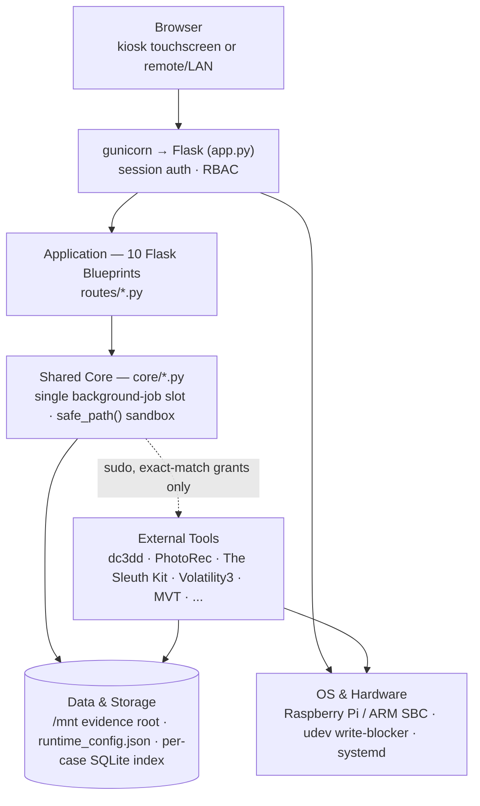

| Layer | What lives there |
|---|---|
| **Client** | Server-rendered Jinja2 templates (`templates/`) + one vanilla-JS file (`static/js/main.js`) — no build step, no framework. Bootstrap 5, Bootstrap Icons, Chart.js, and Leaflet load from CDN (Leaflet is also vendored locally so maps still render on an offline kiosk). |
| **Web & Auth** | `gunicorn` runs `app.py` (a thin ~85-line entry point) behind an optional nginx TLS reverse proxy. A signed session cookie handles real login; HTTP Basic Auth is kept only as an `/api/*` fallback for scripting; the physical kiosk touchscreen bypasses login entirely (scoped to genuinely-local requests). RBAC is 7 permission keys across built-in Admin/Analyst groups plus custom ones. |
| **Application** | 11 Flask Blueprints (`routes/*.py`) — one per feature area: `acquisition`, `mobile`, `recovery`, `file_explorer`, `image_browser`, `case_index`, `reporting`, `case_management`, `settings`, `auth_routes`, `auto_analyze`. |
| **Shared Core** | `core/*.py` — anything more than one Blueprint needs. Most notable: `jobs.py`, which holds the **one** shared background-job slot for the whole app (only one acquisition/recovery/analysis job ever runs station-wide, regardless of which tab started it), and `paths.py`, whose `safe_path()` is the single reused path-traversal boundary every filesystem-touching route goes through. |
| **Privilege boundary** | The service account is unprivileged by design. Every tool that needs to read a raw device is launched via `sudo` with an **exact-match** grant (full absolute binary path, arguments pinned wherever feasible) — never a wildcard on the command itself. |
| **External Tools** | Real, independently-trusted forensic tools, wired together rather than reimplemented — see [What it does](#what-it-does) above for the full list by category. |
| **Data & Storage** | No external database. Everything lives under the evidence root (`/mnt`) as plain files or a per-case SQLite index, plus `runtime_config.json` (station config, `0600`) and an append-only `chain_of_custody.log`. |
| **OS & Hardware** | Raspberry Pi (or similar ARM SBC) running Debian, with a `udev` rule that write-blocks every newly-connected block device and `systemd` managing the service. |

---

## Screenshots

<p align="center">
  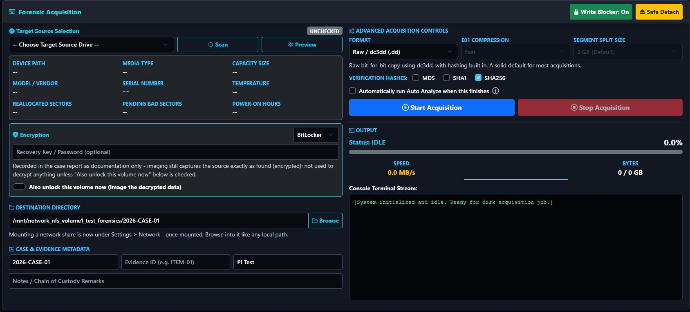
  <br>
  <em>Forensic Acquisition — target drive telemetry, a consolidated Encrypted Volume panel (BitLocker/LUKS/VeraCrypt in one dropdown instead of three separate blocks), format/hash controls, and live status/terminal output, all in one compact card.</em>
</p>

<p align="center">
  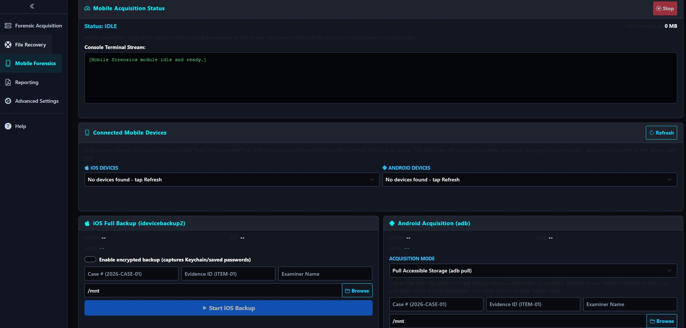
  <br>
  <em>Mobile Forensics — a single iOS/Android mode selector driving one device-detail panel (model, OS version, build, storage, IMEI, WiFi/Bluetooth MAC, activation state) and one Start/Stop + console, instead of separate per-platform cards.</em>
</p>

<p align="center">
  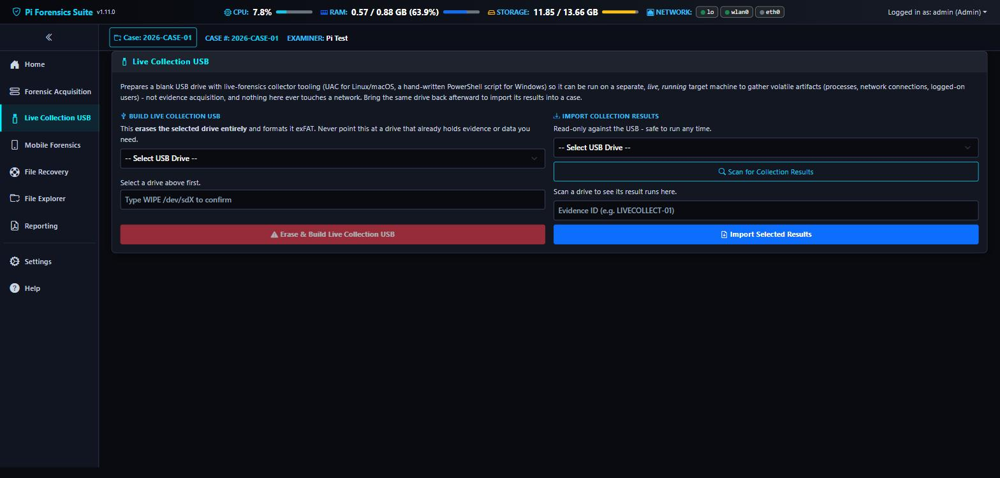
  <br>
  <em>Live Collection USB — its own tab: build a USB with UAC (Linux/macOS/BSD) and a bundled PowerShell script (Windows) to capture volatile state from a separate, still-running machine, then import the results back into a case, read-only against the drive throughout.</em>
</p>

<p align="center">
  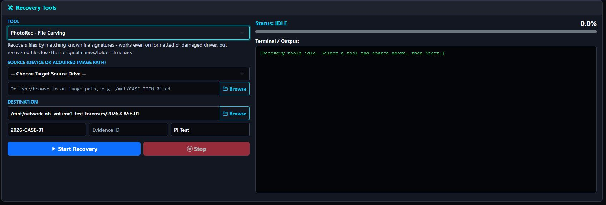
  <br>
  <em>File Recovery — one unified tool selector (PhotoRec shown here, alongside extundelete, foremost, scalpel, TestDisk analysis, and the ddrescue Mapfile Inspector) sharing one source/destination/case layout and one live terminal instead of a screen per tool.</em>
</p>

<p align="center">
  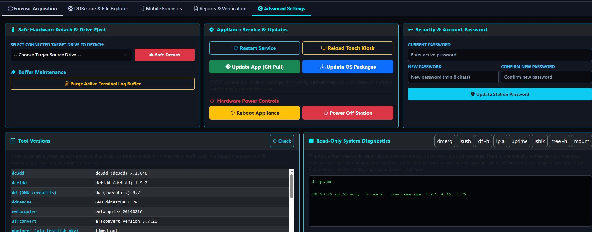
  <br>
  <em>Forensic File Explorer — the folder tree groups an acquired image's disk images and this app's own case-generated artifacts (reports, hash logs, KML exports) out of the way of real evidence, and the Listing table now shows Modified/Accessed/Changed/Created for every file.</em>
</p>

<p align="center">
  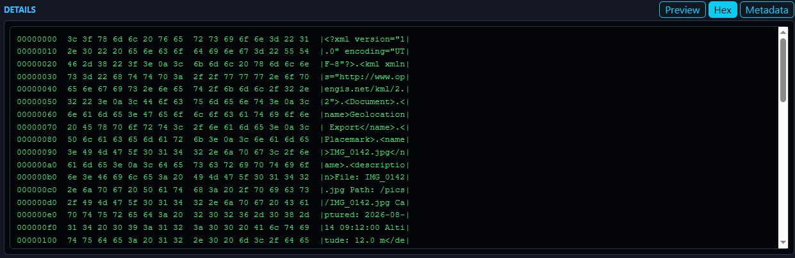
  <br>
  <em>File Explorer's Hex tab — a classic offset/hex/ASCII dump of the selected file, rendered client-side from a capped read for a quick byte-level look with no separate tool.</em>
</p>

<p align="center">
  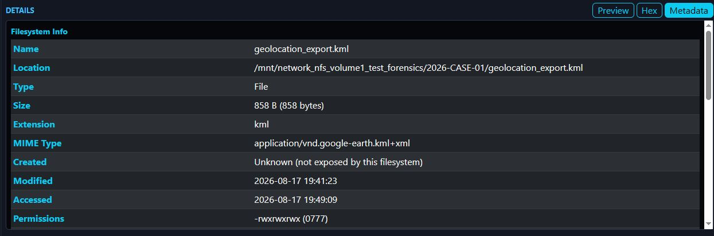
  <br>
  <em>File Explorer's Metadata tab — real filesystem facts (size, extension, MIME type, timestamps, permissions, owner/group) for any file or folder, with ExifTool's embedded metadata layered below for files.</em>
</p>

<p align="center">
  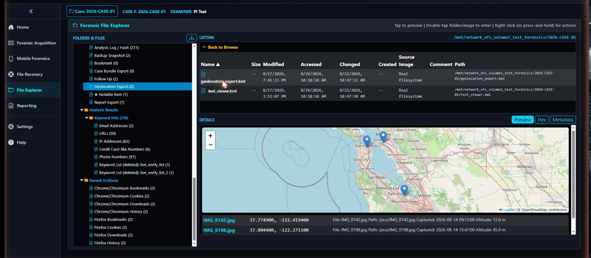
  <br>
  <em>File Explorer — a KML geolocation export previewed inline as a live map (no separate GIS tool needed to see where evidence photos were taken), with the File Views analysis tree (tags, keyword hits, parsed browser artifacts) alongside it.</em>
</p>

<p align="center">
  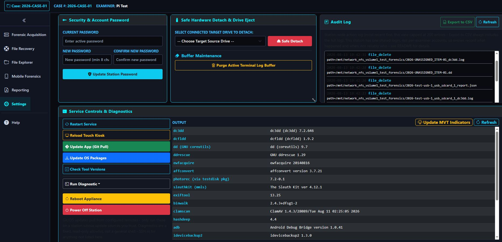
  <br>
  <em>Reporting — the case-wide Overview dashboard (Evidence Items, Tagged Items, Analysis Activity, Case Notes, Exhibits, Case Age at a glance), with Verify All Evidence and Case Bundle Export alongside the full tab set: Report Narrative, Case Notes, Custody Log, Files & Artifacts, Geolocation, Jobs, Evidence Timeline, Audit Trail, Search, and Export.</em>
</p>

<p align="center">
  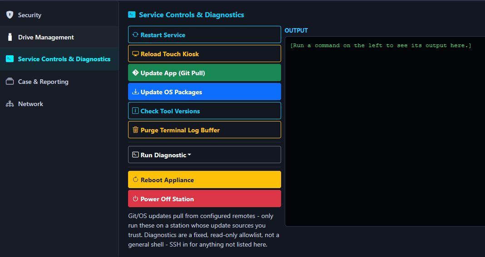
  <br>
  <em>Settings — Service Controls & Diagnostics: restart the service, reload the kiosk, pull app/OS updates, check tool versions, run a fixed diagnostics allowlist, and reboot or power off the station.</em>
</p>

<p align="center">
  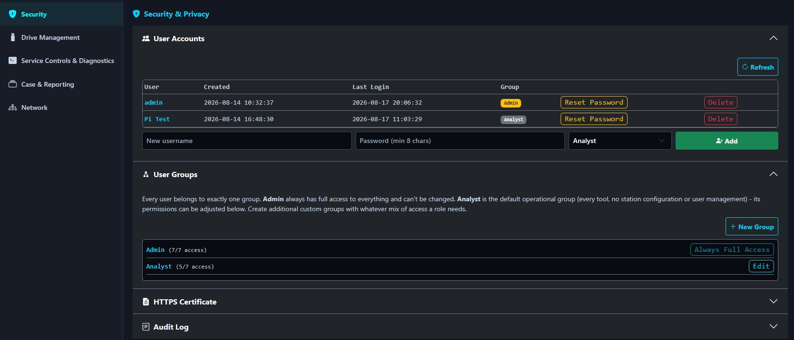
  <br>
  <em>Settings — Security: per-examiner accounts with Created/Last Login tracking, and User Groups for real role-based access control — Admin always has full access, Analyst is the adjustable default, and custom groups can be built from any mix of the 7 permission keys.</em>
</p>

---

## 📋 Prerequisites, Setup & Usage

Pi and bootmedia with Pi OS or other Debian based OS configured
Flash a fresh **Raspberry Pi OS (64-bit) with Desktop** image to your device and connect to the internet. (https://www.raspberrypi.com/documentation/computers/getting-started.html)

> **Kiosk mode requires the Desktop image, not Lite.** The installer's autologin step
> (`raspi-config nonint do_boot_behaviour B4`) and the kiosk browser itself both depend on a
> desktop session (labwc + lightdm) being present. If you flashed the Lite/headless image, the
> web dashboard will still work fine remotely, but there's no desktop for kiosk mode to run in.

### Quick Installation (One-Line Automated Setup)
Open a terminal (or SSH) and run:
```bash
sudo git clone https://github.com/n0sfs/pi-forensics.git /opt/pi-forensics && cd /opt/pi-forensics && sudo python3 install.py
```
This clones the `main` branch — the latest development code, updated continuously. For a stable,
versioned build instead (recommended for anything beyond a quick test), install a tagged
[release](https://github.com/n0sfs/pi-forensics/releases) by adding `--branch vX.Y.Z` to the clone
command, e.g.:
```bash
sudo git clone --branch v1.44.0 https://github.com/n0sfs/pi-forensics.git /opt/pi-forensics && cd /opt/pi-forensics && sudo python3 install.py
```
See [CHANGELOG.md](CHANGELOG.md) for what changed in each release. A station already running can
check its exact version and pull updates from Settings > Service Controls & Diagnostics.

### Interactive Installer Options
During execution, install.py will prompt you to specify the system account:

### Account Creation: 
If the specified username does not exist, the installer will offer to create the user, set their password, and assign the required display/hardware groups (video, render, input, plugdev, disk). It does **not** add the account to the `sudo` group - the scoped `/etc/sudoers.d/pi-forensics` file installed alongside it already grants exactly the privileged commands the app needs (mount/umount, blockdev, smartctl, dc3dd/ddrescue, network configuration, etc.), so the service account never has general root access.

### Dashboard Login:
Separately from the system account above, the installer seeds the first **web dashboard**
account — a real, hashed admin account (username/password you choose), not a plaintext
environment variable. Leave it blank to keep the `admin`/`forensics` defaults, but the installer
will flag that clearly at the end as something to fix before deploying. Additional accounts
(assigned to the built-in Admin/Analyst groups, or a custom group you define) can be created
afterward from Settings > Security.

### Automated System Setup: 
Configures scoped /etc/sudoers.d/pi-forensics privileges, systemd WSGI production services, udev write-blocking rules, labwc kiosk autostart, and - if you accept the prompt - an nginx + self-signed TLS reverse proxy (see [Security](#-security) below).

### Accessing the Dashboard
Local Kiosk: Launches automatically at boot in full-screen touchscreen mode - the installer
enables desktop autologin for the service account so this can happen without a manual login. If
Chromium crashes or is closed, the kiosk autostart script relaunches it automatically after a
short delay rather than leaving a blank screen until the next reboot.
If kiosk doesn't appear after a reboot, check the installer's `[ACTION NEEDED]` summary from your
install run, or verify manually: `sudo raspi-config` → System Options → Boot / Auto Login →
Desktop Autologin, and confirm the account shown matches your service user.

### Remote Web Interface
If you set up TLS during install, navigate to `https://<PI_IP_ADDRESS>` (self-signed cert - your
browser will warn on first visit; you can generate a certificate with correct SANs and download it
for your OS's trust store directly from Settings > Security). Otherwise, navigate to
`http://<PI_IP_ADDRESS>:5000`. Either way, every remote/LAN connection requires a real login - see
[Security](#-security) below for how to set your own credentials before relying on this.

---

## 🔒 Security

This station handles evidence, runs privileged disk-acquisition commands, and is often deployed on
networks the examiner doesn't fully control. It's built with that threat model in mind:

| Area | Behavior |
|---|---|
| **Authentication** | Real session-based login (a signed cookie, set by `/login`) for browser access to the web UI, with an idle timeout - there is **no bypass** for private-subnet or proxied clients, even when nginx is in front of gunicorn. `/api/*` routes also accept plain HTTP Basic Auth as a fallback (for `curl`-style scripted access), never advertised to a browser. The one exception to all of this is the physical kiosk touchscreen itself; see below. Real per-examiner accounts (Werkzeug-hashed passwords) are assigned to built-in Admin/Analyst groups or custom permission groups you define; a station that hasn't created one yet falls back to the single `FORENSIC_USER`/`FORENSIC_PASS` environment-variable account for backward compatibility. |
| **Local kiosk auth bypass (opt-out)** | By default (`FORENSIC_KIOSK_AUTH_BYPASS=1`), the physical kiosk skips the login prompt - physical access to the touchscreen already implies a high trust level (it also gets you the SD card, recovery mode, etc.). This is detected via genuine loopback origin (`request.remote_addr`, the real TCP peer - not a client-supplied header) with no `X-Real-IP` header, or with an `X-Real-IP` header only once that loopback origin is independently confirmed - a remote client proxied through nginx always has `remote_addr` be nginx's own loopback peer address and `X-Real-IP` set to their real address, so **this never weakens remote/LAN/WiFi access**, which stays fully authenticated; a remote client connecting *without* nginx in the path (e.g. TLS/reverse-proxy setup was skipped at install) can no longer spoof this bypass by forging the header, since `remote_addr` in that case is their own real, unspoofable address. Destructive actions (reboot, delete, etc.) still have confirmation dialogs regardless. Set `FORENSIC_KIOSK_AUTH_BYPASS=0` in the systemd unit to require login locally too. |
| **Brute-force protection** | 5 failed logins from an effective client IP triggers a 5-minute lockout (in-memory; resets on service restart) - keyed the same way the kiosk-bypass check resolves the real client identity above, so remote clients proxied through nginx get independent lockout buckets rather than sharing one. |
| **Service privileges** | `app.py` runs as the service account you chose during install (not root, and not a member of the `disk` group). It only reaches root for the specific, whitelisted commands in `/etc/sudoers.d/pi-forensics` (mount/umount/mkdir under `/mnt`, blockdev, smartctl, dc3dd/ewfacquire/ddrescue, cryptsetup/losetup for LUKS and VeraCrypt, dislocker for BitLocker, `nmcli` for network configuration, pkill). Raw device reads for one-off browsing (Live Device Preview) use a temporary, reversible read-only ACL grant on a single whitelisted device path, revoked on exit or by an idle timeout - never a standing group membership. |
| **File-system sandboxing** | The file explorer, report load/save, hash verification, PDF export, and imaging/recovery destinations are all restricted to one directory tree (`FORENSIC_ROOT`, default `/mnt`). Paths outside it are rejected, including via symlink or `../` traversal. |
| **Device validation** | Acquisition/recovery source paths must match a whole-disk device pattern (`/dev/sdX`, `/dev/nvme*n*`, `/dev/mmcblk*`) - arbitrary files can't be pointed at the privileged `ddrescue`/`dc3dd` commands. |
| **Evidence-drive-safe UI** | Filenames and file content pulled from mounted/browsed media are rendered as plain text or inside a fully sandboxed iframe (no scripts, no same-origin access), never trusted as active HTML - a maliciously named or crafted file on a suspect drive can't inject script into the examiner's session. |
| **Acquisition tools run via scoped sudo** | dc3dd/dcfldd/plain `dd`/ewfacquire/PhotoRec/ddrescue all need raw read access to the source device, which this unprivileged service account doesn't have by default - each runs via an exact-match NOPASSWD sudoers entry (never a wildcard on the tool itself). Their output lands owned by root as a side effect; the app automatically hands ownership back to the service account (via a similarly scoped `chown`/`chgrp` grant, fixed target user - never attacker-controllable) so later actions (delete, hash verify, copy) work normally. |
| **Chain-of-custody log** | Every significant action is logged with timestamp, source IP, and (once real accounts are in use) the acting examiner's username - viewable in Settings > Audit Log with search and one-click CSV export of the complete log. |
| **Network configuration safety net** | Changing the station's own IP addressing (Settings > Network Configuration) applies immediately but automatically reverts to the previous working settings after 60 seconds unless explicitly confirmed - protects against a typo locking you out of the very page you'd use to fix it. |
| **Network share credentials** | SMB/CIFS/SFTP passwords are passed via a private, mode-0600 temporary credentials file or piped over stdin rather than on the mount command line, so they don't show up in `ps aux`. |
| **Transport encryption** | `install.py` prompts to set up nginx with a self-signed TLS certificate (generated per-install under `/etc/ssl/pi-forensics`, with SAN entries for the station's actual LAN IP). If accepted, nginx terminates TLS on 80/443 and gunicorn moves to loopback-only; if declined, gunicorn binds directly and both the session cookie and any Basic Auth credentials travel unencrypted. Certificates can be regenerated, downloaded, or replaced with your own from Settings > Security at any time. |
| **No free-text shell access** | The Settings tab's diagnostics panel runs a fixed allowlist of read-only commands (`dmesg`, `lsusb`, `df -h`, `ip a`, `uptime`, `lsblk`, `free -h`, `mount`) as literal argv lists - there is deliberately no general "run any command" box anywhere in the UI or API. A web-exposed shell is a full remote-code-execution hole on a device that images evidence; that trade-off isn't worth the convenience. |
| **Scoped privileged actions** | Power/service-restart/update controls in Settings each map to an exact, pinned sudoers entry (e.g. `systemctl restart pi-forensics.service`, `apt-get update`) rather than a wildcarded binary grant - the service account can't use these entries to run anything beyond what's listed. |
| **Password changes persist safely** | Changing the station password or managing user accounts from Settings writes to `runtime_config.json` in the install directory (mode 0600, owned by the service account), not a world-readable file - it takes effect immediately and survives restarts without needing to edit the systemd unit. |

### Configuration (environment variables)

`FORENSIC_USER`/`FORENSIC_PASS` are set interactively during install (see "Dashboard Login"
above) and written into `/etc/systemd/system/pi-forensics.service`, which the installer restricts
to root-readable (`0600`) since it now holds a real password. This is the fallback account used
only if no real user accounts have been created yet from Settings - once one exists, only accounts
in that list can authenticate. To change these env vars after the fact, edit that file, then
`sudo systemctl daemon-reload && sudo systemctl restart pi-forensics.service`:

| Variable | Default if left blank at install | Purpose |
|---|---|---|
| `FORENSIC_USER` | `admin` | Basic Auth username (fallback account only). |
| `FORENSIC_PASS` | `forensics` | Basic Auth password (fallback account only). |
| `FORENSIC_ROOT` | `/mnt` | Root directory that file-explorer/report/attachment/acquisition-destination paths are sandboxed to. |
| `FORENSIC_KIOSK_AUTH_BYPASS` | `1` | Set to `0` to require login on the physical kiosk touchscreen too. |

If you're deploying this on anything other than an isolated, physically-controlled bench, at
minimum create a real account with a strong password from Settings and set up TLS.

**On the git/OS update buttons:** "Update App (Git Pull)" runs `git pull origin main` in the
install directory and restarts the service on success; "Update OS Packages" runs
`apt-get update && apt-get upgrade -y` in the background. Neither takes attacker-controllable
input, so they aren't injectable - but both pull code or packages from external sources by
design. Only use them on a station where you trust the configured git remote and APT sources.

---

## Maintenance Commands
Restart Web Service:
```Bash
sudo systemctl restart pi-forensics.service
```

View Live Web Engine Logs:
```Bash
sudo journalctl -u pi-forensics.service -f
```

If you set up the TLS reverse proxy, these are also useful:
```Bash
sudo nginx -t                        # validate the config after any manual edits
sudo systemctl reload nginx          # apply config changes without dropping connections
sudo journalctl -u nginx -f          # nginx logs
```

> **Note:** the generated systemd unit runs gunicorn with `--workers 1 --worker-class gthread --threads 8`.
> Job progress (`current_job` in `core/jobs.py`) is tracked in process memory, not a shared store -
> running multiple gunicorn *worker processes* would give each one its own independent copy of that
> state, so a progress-poll request could land on a different worker than the one running the
> acquisition and show stale/default data. Threads (within the single process) don't have this
> problem, and having several available matters in practice: a single request that transiently stalls
> (e.g. on a slow network-mounted evidence share) shouldn't be able to starve every other concurrent
> request - `--threads 8` was chosen after exactly that happened with the previous, lower value. If
> you ever need more request concurrency, raise `--threads`, not `--workers`.

---

## Troubleshooting

### Kiosk mode doesn't start on boot
This almost always means desktop autologin isn't set up for the service account - labwc (the
kiosk compositor) only runs `~/.config/labwc/autostart` when that account's graphical session
actually starts, which requires autologin on a stock image.

1. Check what the installer reported: it prints `[ACTION NEEDED]` at the end of the run if it
   couldn't confirm autologin was configured.
2. Verify/fix manually: `sudo raspi-config` → **System Options** → **Boot / Auto Login** →
   **B4 Desktop Autologin**, confirm the account selected matches your service user, reboot.
3. Confirm you flashed **Raspberry Pi OS with Desktop**, not the Lite/headless image - kiosk mode
   can't work without a desktop session to autologin into.
4. If autologin is confirmed correct and kiosk still doesn't appear, check
   `~/.config/labwc/autostart` exists and is executable (`ls -la`) for the service account's home
   directory, and that it's owned by that account, not root.

### ddrescue fails with an "unaligned read" error, or fails inconsistently
Check the "Direct I/O Mode" checkbox in the ddrescue tab. It maps to ddrescue's real `-d`/
`--idirect` flag (bypasses the kernel cache when reading the source - verified against the actual
GNU ddrescue manual), which is genuinely useful on a failing drive, but the manual is explicit that
*"not all systems support this"* and *"if the sector size is not correctly set, an unaligned read
error may happen."* USB/SATA bridge adapters - common in budget setups - are a frequent source of
this. It defaults to **off** for that reason; try enabling it only if you're getting inconsistent
results with it off.

### Kiosk shows a blank/white screen (chromium process looks healthy)
This is a known bug ([RPi-Distro/chromium#54](https://github.com/RPi-Distro/chromium/issues/54)):
Chromium in kiosk mode on labwc/Wayland can drop out of proper fullscreen if the display's
resolution negotiation settles after Chromium has already started - it doesn't crash, it just ends
up stuck in a broken fullscreen-transition state, which looks exactly like this (process tree
healthy, screen blank). Two mitigations are already in the kiosk autostart script:

- A short delay after enabling outputs, before Chromium launches, to reduce the chance of racing
  the display's mode negotiation.
- A watchdog that force-restarts Chromium every 30 minutes regardless of whether it's "crashed" -
  since this bug doesn't actually crash the process, the normal crash-recovery loop can't catch it
  on its own.

If it happens between watchdog cycles, `sudo pkill -9 -f "chromium.*--kiosk"` from SSH will trigger
an immediate respawn without a full reboot. **Don't manually re-run the autostart script itself**
(`bash ~/.config/labwc/autostart`) - it already runs continuously in the background from boot, and
launching a second copy on top of it starts a competing supervisor loop, which looks like the
screen rapidly flashing/flickering. `pkill` alone is enough; the existing loop relaunches Chromium
on its own within a few seconds.

### On-screen keyboard for kiosk mode
Chromium's `--kiosk` mode has no built-in virtual keyboard (that's a tablet-OS feature, not a
browser one). This project ships `wvkbd` for that purpose, but it's currently **disabled by
default** - it was found crash-looping on at least one real deployment. Since the local kiosk auth
bypass (see [Security](#-security) above) removed the original need for it (typing into a native
login prompt), it's off rather than left actively breaking the kiosk display. For case numbers,
evidence IDs, and notes on the touchscreen in the meantime, use a physical USB keyboard. See the
comment block in `install.py`'s kiosk autostart section for how to re-enable and debug it if you
want to pursue that.

### "Browse Image" fails on an E01 file but works fine on .dd/.raw
The Sleuth Kit image browser (`pytsk3`) ships with `libewf` support built into its published
wheels, so E01 support should work out of the box. If it doesn't, confirm `pytsk3` installed
correctly (`pip show pytsk3` inside the app's venv) - raw `.dd`/`.raw` images are unaffected either
way.

### Web dashboard isn't reachable over the LAN/WiFi
1. **Is the service actually running?** `sudo systemctl status pi-forensics.service` - if it's not
   active, check `sudo journalctl -u pi-forensics.service -e` for the actual startup error.
2. **If you set up TLS**, nginx is what's actually listening on the network (gunicorn moves to
   loopback-only). Check `sudo systemctl status nginx` too - if nginx isn't running, the service
   being fine doesn't help you from another device.
3. **Did the Pi's IP address change?** A DHCP lease renewal after reboot is a common, totally
   unrelated cause of "it stopped working" - check `hostname -I` or your router's client list for
   the current address rather than assuming it's the same as last time. If this keeps happening,
   set a static IP for the station directly from Settings > Network Configuration (protected by an
   automatic revert if you get it wrong) instead of relying on your router remembering a lease.
4. **Client isolation on the WiFi network.** Some routers (especially guest networks or mesh
   systems) block device-to-device traffic by design - try from a device on the same network
   segment, or check your router's AP isolation setting.
5. Once you've confirmed the service is up and you have the right IP, use the diagnostics in
   Settings (`ip a`) from a device that *can* reach it (e.g. the kiosk itself, which talks
   to gunicorn over loopback regardless of LAN status) to see what address it's actually on.

### Login fails even with the right password
Check for the brute-force lockout (5 failed attempts = 5 minute lockout, returns HTTP 429) before
assuming the credentials are wrong - repeated attempts while troubleshooting something else is a
common way to trigger this.

---

## Uninstalling

```bash
cd /opt/pi-forensics
sudo python3 uninstall.py
```

This reverses what `install.py` set up: stops/disables the `pi-forensics` service (and any legacy
`pi-kiosk` unit), removes the nginx site and TLS materials, removes the sudoers and udev rules, and
optionally removes `/opt/pi-forensics` itself and the service system user. Each destructive step
asks for confirmation individually. **Evidence images under `/mnt` or your network mounts are never
touched** - only application/service configuration is removed. System packages (`dc3dd`, `nginx`,
etc.) are intentionally left installed; the script prints the `apt remove` command to run them
yourself if you want them gone too.

---

## Contributors
Contributions welcome! Submit pull requests or open issues for improvements or bug reports.

---

## Disclaimer and License
Provided as-is, without any warranty and distributed under the GNU General Public License v3 or later. You can redistribute and/or modify it under the terms of this license. Its methodology has been vetted to be forensically sound, but always verify the integrity of your images using appropriate forensic tools and procedures.
See prior research here: "Low Budget Forensics using ARM Based Single Board Computers" - https://commons.erau.edu/jdfsl/vol11/iss1/3/

This project's own MIT license covers its own original code only. To do its job, the station installs, imports, vendors, or loads a large number of pre-existing third-party forensic tools, Python libraries, and frontend assets (`dc3dd`, The Sleuth Kit, ClamAV, Volatility 3, MVT, Bootstrap, Leaflet, and dozens more) — each keeps its own separate license, none of which are covered by this project's MIT license. See **[THIRD_PARTY_NOTICES.md](THIRD_PARTY_NOTICES.md)** for the full list, including a few (MVT, Volatility 3, SQLite Dissect) that carry non-standard terms worth reading directly rather than assuming they behave like a typical open-source license. It's also viewable from inside the app itself under Help > Third-Party Notices.
