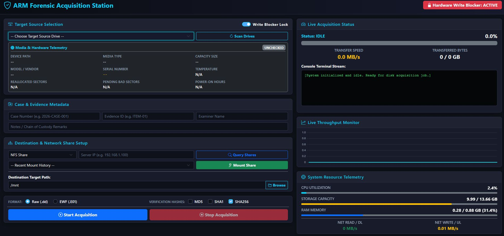

# pi-forensics, arm-forensic-station
Low Budget Forensic Drive Imaging Using Arm Based Single Board Computers

# 🛡️ Raspberry Pi ARM Forensic Acquisition Station

An open-source, web-based digital forensic imaging appliance built for Raspberry Pi and ARM single-board computers. Designed for field kit deployment, evidence collection, and network-streamed disk imaging. Based on my original research "Low Budget Forensics using ARM Based Single Board Computers"
https://commons.erau.edu/jdfsl/vol11/iss1/3/


---

## 🌟 Key Features

- **Bit-Stream Acquisition:** Leverages `dc3dd` for raw image acquisition (`.dd`) with hash verification (MD5, SHA-1, SHA-256).
- **ARM Memory-Safe Architecture:** Built with non-blocking process pipelines and active memory buffer syncing (`os.sync()`) to eliminate Out-Of-Memory kernel panics on embedded hardware.
- **Integrated Network Mounting:** Auto-discovers, authenticates, and mounts remote SMB/CIFS, NFS, and FTP shares natively in the UI with protocol fallback support.
- **SMART Health Diagnostics:** Instant drive health checks (`smartctl`) inspecting reallocated sectors, temperature, power-on hours, and bad block flags prior to imaging.
- **Software Write-Blocker Toggle:** Quick toggle for `udev` read-only rule enforcement (`ATTR{ro}="1"`) to preserve chain of custody.
- **Automated Evidence Manifests:** Generates structured `evidence_manifest.json` and human-readable `.txt` reports capturing case numbers, evidence IDs, examiner notes, drive serials, and timestamps.
- **Touchscreen & Remote Friendly:** Responsive dark-mode UI designed for onboard Pi touchscreen displays or headless browser control over Wi-Fi/Ethernet.

---

## 📸 Interface Screenshots

<p align="center">
  
  <br>
  <em>Figure 1: Overall Dashboard with Drive Check, Write Blocker Toggle, Raw/EWF Output, MD5/SHA1/SHA256 Hashes and Native Network Discovery, Drive Mapping and Telemetry.</em>
</p>

---

## 📋 Prerequisites

System packages and services required on the host Raspberry Pi (Debian/Raspberry Pi OS):

```bash
sudo apt update
sudo apt install -y python3-full python3-pip python3-openssl python3-flask python3-flask-httpauth python3-psutil smartmontools dc3dd smbclient nfs-common curlftpfs cifs-utils ewf-tools afflib-tools
sudo apt upgrade -y

#Clone Repository & Install Python Requirements
#Modern Raspberry Pi OS releases enforce PEP 668 to protect system Python packages. Modern Raspberry Pi OS releases enforce PEP 668 to protect system Python packages. Setting up a dedicated virtual environment (venv) ensures isolated and reliable package installation: If installing Python requirements via pip, pass --break-system-packages (or rely on the APT packages installed above):
cd /opt
sudo git clone https://github.com/n0sfs/pi-forensics.git
cd pi-forensics
# Create virtual environment
python3 -m venv venv
# Install dependencies into virtual environment
./venv/bin/pip install --upgrade pip
./venv/bin/pip install -r requirements.txt pyOpenSSL

#Copy Systemd Units & Enable Services
sudo cp /opt/pi-forensics/systemd/pi-forensics.service /etc/systemd/system/

#To register the service with systemd and launch the engine automatically on boot:
sudo systemctl daemon-reload
sudo systemctl enable --now pi-forensics.service


